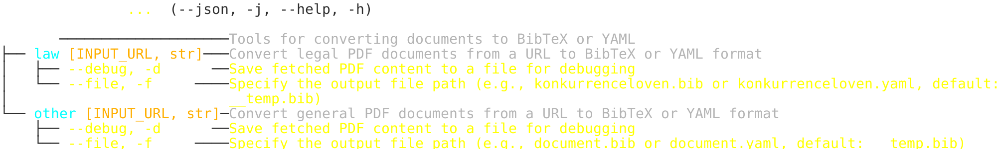
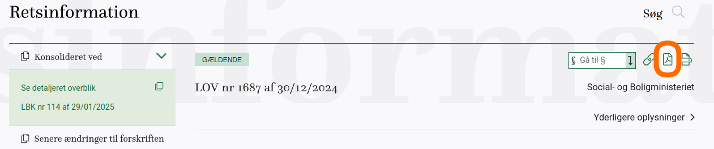

# lawcite

Convert a Danish statute into a **paragraph-addressable** citation database:
one entry per provision (`Kapitel` / `§` / `Stk.`), output as BibTeX,
Hayagriva YAML, or Markdown — the format is chosen by the output file
extension.

Laws are fetched from the structured [retsinformation](https://retsinformation.dk)
API (chapters → § → stk → litra, with metadata), so each paragraph becomes its
own citable key for use in LaTeX or Typst.

## Installation

```bash
uv pip install git+https://github.com/evidlabel/lawcite.git
```

## Usage

`lawcite` has two commands:

- **`law <name | year/number>`** — fetch a law from the structured API and emit
  a namespaced citation entry per provision.
- **`other <pdf-url>`** — for general PDFs the API doesn't cover (vejledninger,
  articles).

```bash
# whole act, by name → Hayagriva YAML
uv run lawcite law konkurrenceloven -f kl.yaml

# narrow lookup (only §§ 9–12), by year/number
uv run lawcite law 2024/1150 -p 9-12 -f kl.yaml

# a general PDF → Markdown
uv run lawcite other <pdf-url> -f doc.md
```

The output format follows the file extension: `.bib` (BibTeX), `.yaml`
(Hayagriva), or `.md` (Markdown).



PDF links for the `other` command can be obtained from
[retsinformation](https://retsinformation.dk):



## Data source & rate limit

Laws come from the third-party `retsinformation-api.dk` structured API, which
shares a daily request limit. Responses are cached on disk under
`$LAWCITE_CACHE_DIR` (default `~/.cache/lawcite`); on a rate limit with a cache
miss, `lawcite` falls back to the official retsinformation PDF endpoint. The API
covers legislation only — vejledninger are handled via `other`.

## Disclaimer

`lawcite` converts legal documents into citation databases for use in LaTeX or
Typst. It does not provide legal advice or interpret content. The tool
represents data from retsinformation.dk without modification to the original
text. Users are responsible for verifying the accuracy and applicability of the
data for their purposes.
