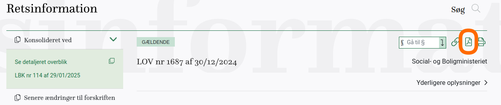

# lawcite

Tools for converting PDF documents to BibTeX format for citing in LaTeX or typst, with support for Danish laws and general documents.

## Installation

```bash
uv pip install https://github.com/evidlabel/lawcite.git
```

## Usage


`lawcite` usage:


Pdf links can be obtained from [retsinformation](https://retsinformation.dk)



## Programmatic Example

To download a set of common Danish laws in Markdown format, run:

```bash
python examples/process_laws_md.py
```

This will process several laws and save them as `.md` files in the `examples/` directory, skipping any that already exist.

## Disclaimer

`lawcite` is a tool for converting PDF documents into BibTeX format for use in LaTeX or typst. 

It does not provide legal advice or interpret content. 

The tool processes and represents data from retsinformation.dk, without modification to the original content. 

Users are responsible for verifying the accuracy and applicability of the data for their purposes.
