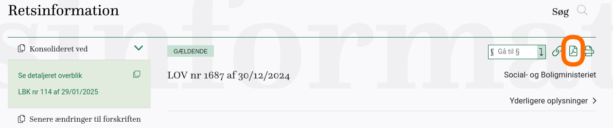

# Usage

This section describes how to use the lawcite command-line tools. Ensure you have activated the Poetry virtual environment with `poetry shell` before running commands.

## Converting laws from `retsinformation.dk`
Laws are divided up in a particular format, using § and stk to subdivide. 
Each stk is translated to bibtex as one entry.
```bash
lawcite law https://www.retsinformation.dk/api/pdf/244970
```

Specify a custom output filename for the BibTeX file:
```bash
lawcite law --name konkurrenceloven.bib https://www.retsinformation.dk/api/pdf/244970
```

Use debug mode to save the fetched PDF for inspection:
```bash
lawcite law --debug https://www.retsinformation.dk/api/pdf/244970
```

The link used is on the retsinformation.dk website in the top right corner (right-click and copy link address). 


The `law` command expects PDFs with metadata (title, date, ministry) on the first page and paragraphs marked by `§`. It supports dynamic API URLs (e.g., `retsinformation.dk/api/pdf/`). BibTeX entries use the PDF's title as the `journal`, the ministry as the `author`, and clean keys (e.g., `konkurrencelovenp9stk2`). Use `--name` to specify the output BibTeX filename, or it defaults to a cleaned version of the document title (e.g., `konkurrenceloven.bib`). Use `--debug` to save the PDF for troubleshooting.

## Converting other documents from `retsinformation.dk`

Convert a general PDF to BibTeX format, citing each paragraph with an incremental ID:
```bash
lawcite other https://www.retsinformation.dk/api/pdf/233142
```

Specify a custom output filename:
```bash
lawcite other --name psykologretningslinjer.bib https://www.retsinformation.dk/api/pdf/233142
```

Use debug mode to save the fetched PDF:
```bash
lawcite other --debug https://www.retsinformation.dk/api/pdf/233142
```

The `other` command processes any PDF, splitting content into paragraphs (separated by blank lines) and assigning incremental IDs (e.g., `para1`, `para2`). Each paragraph generates a separate BibTeX entry with the PDF's title as the `journal`, the extracted author (or 'Unknown Author'), and keys like `psykolognvnetsvejledenderetningslinjer_para1`. Use `--name` to specify the output filename, or it defaults to a cleaned version of the document title (e.g., `psykolognvnetsvejledenderetningslinjerforautoriseredepsykologer.bib`).

## Batch Processing

To process multiple laws listed in `examples/laws.yml` and save them as BibTeX files in the `examples` directory, run:
```bash
python examples/process_laws.py
```

This script reads the `laws.yml` file and generates `.bib` files (e.g., `examples/konkurrenceloven.bib`) for each law. If a `.bib` file already exists for a law, the script skips downloading and processing it to avoid overwriting existing files.

An example LaTeX document using these `.bib` files is provided in `examples/test.tex`, which demonstrates citing multiple Danish laws.

## Citing laws in LaTeX

After generating a BibTeX file (e.g., `konkurrenceloven.bib`) with `lawcite law --name konkurrenceloven.bib https://www.retsinformation.dk/api/pdf/244970`, you can use it in a LaTeX document to cite sections of the Danish Competition Act (konkurrenceloven). Below is an example LaTeX document:

```latex
\documentclass{article}
\usepackage{hyperref}
\usepackage[backend=biber]{biblatex}
\addbibresource{konkurrenceloven.bib}

\begin{document}
\noindent Here is a citation to the konkurrenceloven \cite{konkurrencelovenp9stk2}.

\printbibliography

\end{document}
```
This will produce a document with a citation to §9, Stk. 2 of the konkurrenceloven, with the bibliography formatted according to the BibTeX entry generated by `lawcite`.

For general documents, after running 
```bash
lawcite other --name psykologretningslinjer.bib https://www.retsinformation.dk/api/pdf/233142
```
you can cite paragraphs like:
```latex
\cite{psykolognvnetsvejledenderetningslinjerforautoriseredepsykologer_para1}
```
## Citing laws in Typst
When using typst instead of latex, the laws can be cited as follows:
```typst
@konkurrencelovenp10stk2
#bibliography(("straffeloven.bib","konkurrenceloven.bib","forældreansvarsloven.bib"),full:true)
```


## Example output files
<div style="max-height: 400px; overflow-y: auto; border: 1px solid #ccc; padding: 10px;" markdown="1">
```bib
--8<-- "docs/assets/konkurrenceloven.bib"
```
</div>

<div style="max-height: 400px; overflow-y: auto; border: 1px solid #ccc; padding: 10px;" markdown="1">
```bib
--8<-- "docs/assets/forldreansvarsloven.bib"
```
</div>

